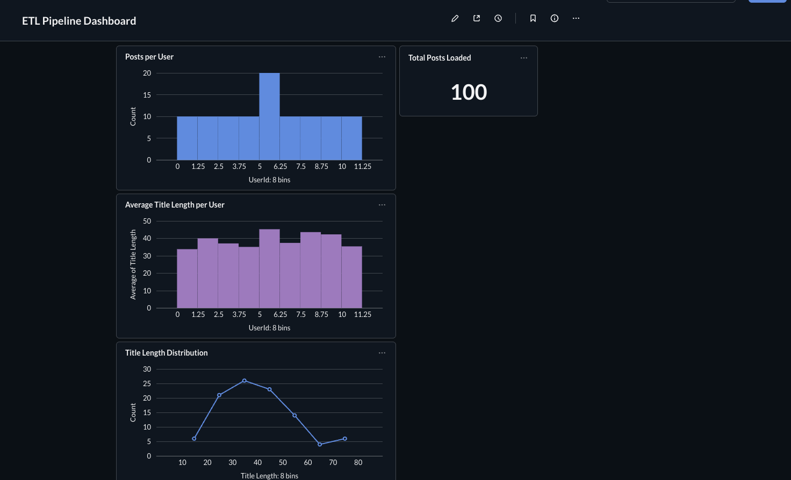
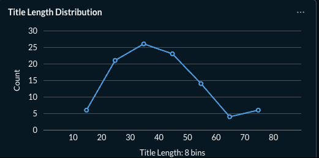

# Airflow ETL Data Pipeline

## Project Overview

This project demonstrates an **end-to-end data engineering pipeline** built using **Python, Apache Airflow, PostgreSQL, Docker, and Metabase**.

The pipeline extracts data from an API, transforms it, loads it into PostgreSQL, and visualizes insights using a Metabase dashboard.

---

# Architecture

```
API
 ↓
Python ETL Pipeline
 ↓
Apache Airflow Scheduler
 ↓
PostgreSQL Database
 ↓
Metabase Dashboard
```

---

# Tech Stack

* Python
* Apache Airflow
* PostgreSQL
* Docker
* Metabase
* SQL
* Pandas
* SQLAlchemy

---

# Pipeline Workflow

1. Extract data from external API
2. Transform and clean the dataset
3. Load processed data into PostgreSQL
4. Schedule the pipeline with Airflow
5. Visualize insights with Metabase dashboards

---

# Airflow DAG


---

# Metabase Dashboard



---

# Example Visualizations

## Posts per User


---

## Total Posts Loaded


---

## Average Title Length per User


---

## Title Length Distribution



---

# How to Run the Project

### Clone the repository

```
git clone https://github.com/1998-aish/airflow-etl-data-pipeline.git
cd airflow-etl-data-pipeline
```

### Start the services

```
docker compose up -d
```

---

# Access the Applications

Airflow UI

```
http://localhost:8080
```

Metabase Dashboard

```
http://localhost:3000
```

---

# Future Improvements

* Add data quality checks
* Implement Airflow retry and alert mechanisms
* Integrate CI/CD pipeline
* Add monitoring and logging

---

# Author

Aishwarya
