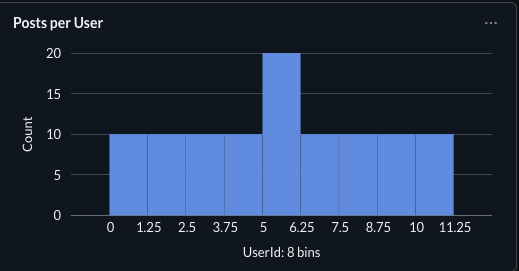
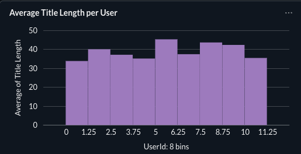

# Airflow ETL Data Pipeline

## Project Overview

This project demonstrates an **end-to-end data engineering pipeline** built using Python, Apache Airflow, PostgreSQL, Docker, and Metabase.

The pipeline extracts data from an API, transforms it, loads it into PostgreSQL, and visualizes insights using Metabase dashboards.

---

## Architecture

API
↓
Python ETL Pipeline
↓
Apache Airflow Scheduler
↓
PostgreSQL Database
↓
Metabase Dashboard

---

## Tech Stack

* Python
* Apache Airflow
* PostgreSQL
* Docker
* Metabase
* SQL
* Pandas
* SQLAlchemy

---

## Pipeline Workflow

1. Extract data from external API
2. Transform and clean the dataset
3. Load processed data into PostgreSQL
4. Schedule the pipeline with Airflow
5. Visualize insights with Metabase dashboards

---

## Airflow DAG

(Dashboard/Airflow DAG page.png)

---

## Metabase Dashboard

(Dashboard/Metabase dashboard.png)

---

## Example Visualizations

### Posts per User



### Total post loaded


### Average Title Length per User



### Title Length Distribution


---

## How to Run the Project

Clone the repository

```
git clone https://github.com/1998-aish/airflow-etl-data-pipeline.git
cd airflow-etl-data-pipeline
```

Start services

```
docker compose up -d
```

Access services

Airflow
http://localhost:8080

Metabase
http://localhost:3000

---

## Future Improvements

* Add data quality checks
* Implement Airflow task retries and alerts
* Add CI/CD pipeline for automated deployment
* Integrate monitoring and logging

---

## Author

Aishwarya

